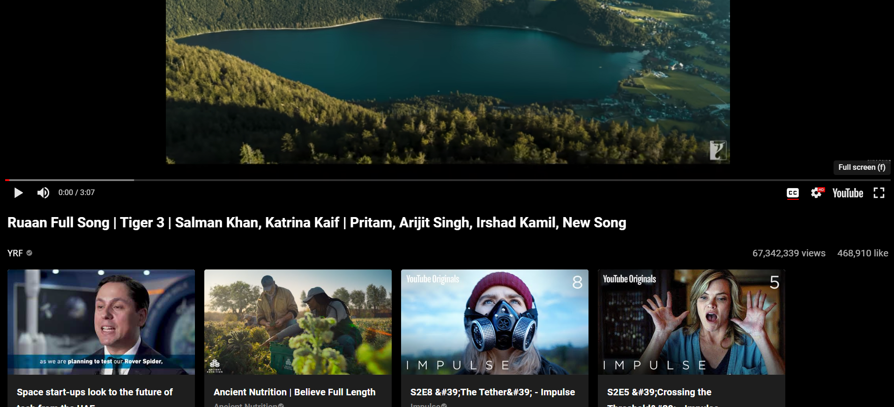

<h1 align="center" id="title">YouTube Clone</h1>

<p align="center"></p>

<h2>🚀 Demo</h2>

[https://ad-mytube.netlify.app/](https://ad-mytube.netlify.app/)

<h2>Project Screenshots:</h2>


<p><h4>The website's homepage allows you to browse content and search for specific creators or videos..</h4></p>


<p><h4>Video playback controls include options to adjust playback speed and resolution. Additionally, view and like counts are displayed, and similar videos are suggested below the video player..</h4></p>


<p><h4>The information about the channel along with its published videos is displayed on its homepage.</h4></p>


<p><h4>You can also search for a specific creator or video on the platform..</h4></p>


<p><h4>I just wanted to remind you that you can switch to a particular genre on the home page as well. It's really easy to do - just click on the genre you're interested in and you'll see a list of related content</h4></p>


<h2>🛠️ Installation Steps:</h2>

<p>1. Clone this repository</p>

```
git clone https://github.com/AbhiD1678/Youtube_Clone.git
```

<p>2. Navigate to the project directory</p>

```
cd Youtube_Clone
```

<p>3. Install dependencies</p>

```
npm install
```

<p>4. Start the development server</p>

```
npm start
```

  
  
<h2>💻 Built with</h2>

Technologies used in the project:

*   React
*   React-Router-Dom
*   Axios
*   Material UI
*   CSS
*   RapidApi

<h2>🛡️ License:</h2>

This project is licensed under the MIT License
